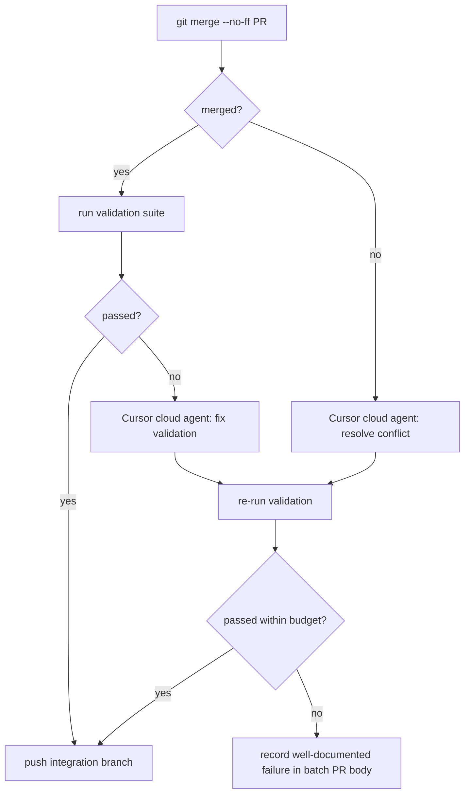

# dependabot-batch-merge

A GitHub Action that consolidates open Dependabot pull requests into a single integration branch, validates each merge with a configurable suite, and opens one batch PR against the base branch.

Failures are explained by a Cursor Cloud agent when an API key is configured; otherwise a static "exit code + stderr tail" explanation is written into the batch PR body.

> **v1 scope.** The action is hard-coded to `Maersk-Global/ui-myfinance` in `src/config.ts`. Onboarding additional repositories is a deliberate follow-up that requires a code change and a new release. v1 also supports manual dispatch only — scheduled runs are a planned follow-up.

## How it works

1. Cuts an integration branch from `base-branch` (default `main`), force-pushed so same-day re-runs overwrite prior remote state.
2. Lists open PRs authored by Dependabot in `Maersk-Global/ui-myfinance`, oldest first, capped at `max-prs`.
3. For each PR: merges into the integration branch with `--no-ff`, then runs the configured validation command.
   - **PASS** → push the integration branch and continue.
   - **FAIL** → ask the failure analyzer to explain. Then either `skip` (drop the merge with `reset --hard HEAD~1`) or `revert-commit` (keep the merge, append a `git revert`), and continue.
4. Optionally re-runs the validation suite on the integration branch tip to catch cross-PR interactions.
5. Opens or updates a draft batch PR against `base-branch`. The PR body contains a live results table, a per-failure section, and a machine-readable list of PASSed source PR numbers.

Source Dependabot PRs are not closed automatically when their changes land on `main` via another PR ([dependabot/dependabot-core#3880](https://github.com/dependabot/dependabot-core/issues/3880)). Closing superseded source PRs after the batch PR merges remains a planned follow-up.

## Architecture: central orchestrator

This repository **is** the workflow host. There is no consumer-side workflow. The `Maersk-Global/ui-myfinance` repository does not need any file added to it — it just needs to grant the central PAT read/write access to its contents and pull requests.

```
┌────────────────────────────────────────┐
│ obaDev95/dependabot-batch-merge        │
│                                        │
│  .github/workflows/batch.yml           │
│    workflow_dispatch  ──┐              │
│                         │              │
│  src/  (Node.js action) │              │
│    invoked via          ▼              │
│    uses: ./@main                       │
│                                        │
└──────────────────┬─────────────────────┘
                   │ checks out, merges PRs,
                   │ opens batch PR
                   ▼
┌────────────────────────────────────────┐
│ Maersk-Global/ui-myfinance             │
│   (target repo — only grants PAT       │
│    access; no workflow file needed)    │
└────────────────────────────────────────┘
```

## Running the workflow

From this repository's **Actions → Dependabot batch merge → Run workflow**:

| Dispatch input | Type | Default | When to change |
| --- | --- | --- | --- |
| `max-prs` | number | `50` | Increase if the backlog has grown beyond the default. |

The workflow checks out `Maersk-Global/ui-myfinance`, configures npm auth for GitHub Packages, and invokes the action with the repository PAT. Validation uses the action's default command unless overridden via the `validation-command` action input (not exposed in the workflow dispatch UI today).

### Typical run sequence

1. Dispatch the workflow. The action opens (or updates) a draft batch PR with the merge results.
2. Review and merge the batch PR yourself, the same way you'd merge any chore PR.
3. Manually close superseded Dependabot source PRs as needed (automation planned).

## Required secrets (on **this** repo)

| Secret | Required | Purpose |
| --- | --- | --- |
| `TARGET_REPO_PAT` | yes | PAT with **Contents: RW** and **Pull requests: RW** on `Maersk-Global/ui-myfinance`. Used both for `actions/checkout` and for the action's GitHub API calls. |
| `CURSOR_API_KEY` | optional | Cursor Cloud API key. Without it, validation failures fall back to a static explanation (exit code + stderr tail). |

## Action inputs (full list)

| Input | Default | Description |
| --- | --- | --- |
| `base-branch` | `main` | Branch the integration branch is cut from and the batch PR targets. |
| `integration-branch-prefix` | `chore/dependabot-batch` | Prefix of the integration branch. A `-YYYY-MM-DD` suffix is appended. |
| `dependabot-author` | `dependabot[bot]` | Login used to identify Dependabot PRs. |
| `validation-command` | `npm ci && npm run typecheck && npm test && npm run build` | Shell command run after each merge. Runs through `bash -lc`. |
| `on-failure` | `skip` | `skip` drops a failed merge; `revert-commit` keeps it and appends a revert. |
| `re-run-final-suite` | `true` | Re-run validation on the integration branch tip before opening the batch PR. |
| `draft-pr` | `true` | Open the batch PR as a draft. |
| `max-prs` | `20` | Safety cap on PRs processed per run. |
| `cursor-api-key` | _(optional)_ | Cursor Cloud API key. |
| `github-token` | `${{ github.token }}` | Token for the GitHub API. The central workflow passes `TARGET_REPO_PAT`. |

Owner and repo (`Maersk-Global/ui-myfinance`) are hard-coded in `src/config.ts` for v1 and are not action inputs.

## Outputs

| Output | Description |
| --- | --- |
| `batch-pr-number` | Number of the batch PR opened or updated. Empty string if no PR was opened (e.g. all candidates failed and were skipped). |
| `batch-pr-url` | URL of the batch PR. Empty string if no PR was opened. |
| `pass-count` | Number of source PRs that PASSed validation. |
| `fail-count` | Number of source PRs that FAILed validation. |

## Repository layout

```
src/
  index.ts                 GitHub Action entry point
  mcp-server.ts            MCP server entry point (McpServer.registerTool)
  batch.ts                 Wires dependencies and runs BatchOrchestrator
  orchestrator.ts          BatchOrchestrator — top-level coordinator
  config.ts                Action input parsing (owner/repo hard-coded for v1)
  github/                  Octokit-backed PR listing and PR writing
  git/                     git CLI wrappers (branch management, merge/revert)
  validation/              ValidationRunner interface + command-based impl
  analysis/                FailureAnalyzer interface + Cursor Cloud impl
  report/                  Markdown report + PASSed-PR machine block
tests/                     Vitest unit tests
.github/workflows/
  batch.yml                The central orchestrator
  ci.yml                   This repo's own CI
action.yml                 Action metadata (used directly by batch.yml)
dist/index.js              Committed bundle (ncc-built; required by node20 runtime)
dist-mcp/index.js          Committed MCP bundle
```

## Cursor Cloud integration

`CursorFailureAnalyzer` posts to `https://api.cursor.com/v0/agents/runs` with a JSON body and falls back to a static explanation if the call fails. **The exact endpoint shape should be confirmed against the Cursor Cloud documentation before relying on it in production.** Only the `callCursor` method needs adjustment — the rest of the orchestration is insulated behind the `FailureAnalyzer` interface.

## MCP server

The action logic is also exposed as an MCP tool via `dependabot-batch-merge-mcp` (`src/mcp-server.ts`). The server uses `McpServer.registerTool` from `@modelcontextprotocol/sdk` and exposes a single `run-batch-merge` tool.

Build with `npm run build:mcp`. Configure in your MCP client:

```json
{
  "mcpServers": {
    "dependabot-batch-merge": {
      "command": "node",
      "args": ["/path/to/dependabot-batch-merge/dist-mcp/index.js"]
    }
  }
}
```

## Local development

```bash
npm install
npm run typecheck
npm test
npm run build      # bundles to dist/index.js (committed for the Action runtime)
npm run build:mcp  # bundles to dist-mcp/index.js
```

CI also verifies that `dist/` is up to date — re-run `npm run build` and commit the result before pushing source changes.

## Expanding scope beyond v1

When another team is ready to onboard:

1. Replace the hard-coded `owner` / `repo` in `src/config.ts` with an allowlist (env-driven or input-driven).
2. Update `action.yml` and `.github/workflows/batch.yml` input descriptions and defaults.
3. Update this README's "v1 scope" callout.
4. Cut a new release tag.

Keeping the hard-lock in code rather than relying on workflow-level convention means scope expansion is explicit and reviewable in a single PR.

## Future: agentic conflict and validation resolution

The next iteration may delegate merge conflicts and validation failures to a Cursor cloud agent before recording a failure in the batch PR body. This is **not implemented**; the notes below define the intended contract.



Proposed interface (parallel to the existing `FailureAnalyzer`):

```ts
interface AgenticResolver {
  resolveConflict(input: { pr: DependabotPR; conflictedFiles: string[] }): Promise<ResolutionOutcome>;
  resolveValidation(input: { pr: DependabotPR; validation: ValidationOutcome }): Promise<ResolutionOutcome>;
}
type ResolutionOutcome =
  | { kind: 'resolved'; commitSha: string }
  | { kind: 'gave-up'; reason: string };
```

Constraints:

- **Runtime:** Cursor SDK (`@cursor/sdk`) cloud — `Agent.create` / `Agent.prompt` with the integration branch as context; the action polls `run.messages` until the agent pushes a fix commit or returns "gave up". Authentication via a new `CURSOR_AGENT_KEY` secret distinct from `CURSOR_API_KEY` (analyzer key).
- **Opt-in:** new `agentic-resolve` action input (default `false`); when off, current `skip` / `revert-commit` behavior is unchanged.
- **Hard caps:** 1 agent attempt per PR per kind, a 10-minute timeout, total run-level budget (e.g. ≤ 5 agent invocations).
- **Success criterion:** validation passes after the agent's pushed commit. Anything else → `gave-up` and the orchestrator records the same well-documented failure it writes today.
- **Slot points:** in `processPr`, replace the immediate failure return on `merge.kind === 'conflict'` and on `validation.passed === false` with a call into the resolver when `config.agenticResolve === true`.
- **Cursor analyzer:** the existing `https://api.cursor.com/v0/agents/runs` endpoint in `CursorFailureAnalyzer` is unverified; agentic loop work is the natural moment to replace it with the documented Cursor SDK surface.
